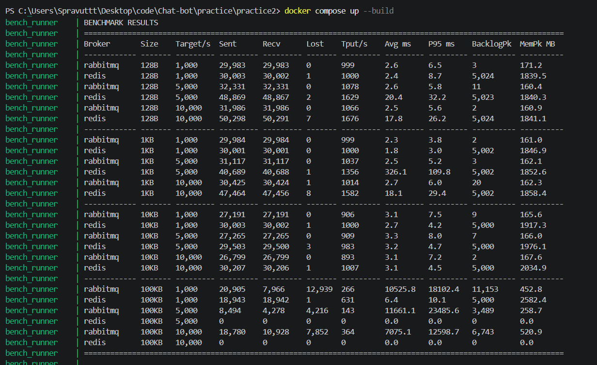
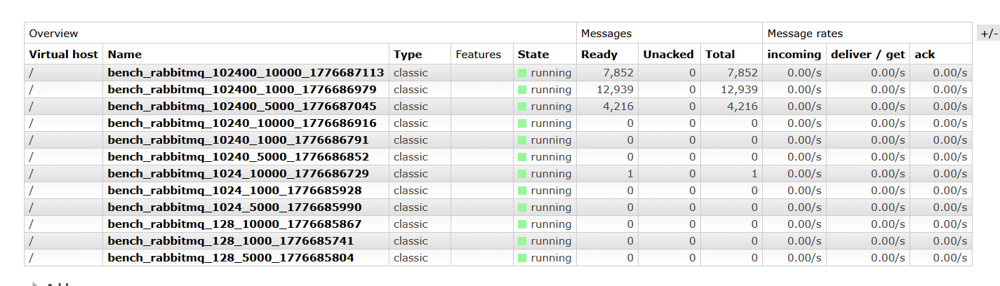
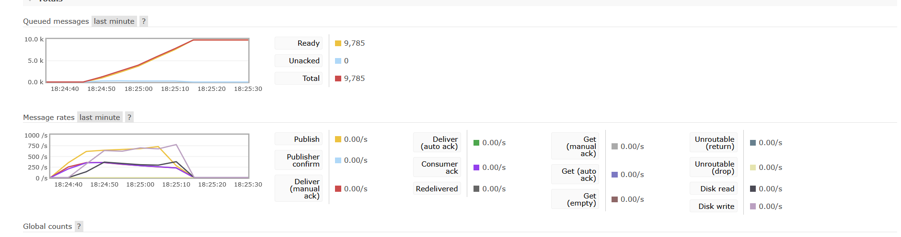
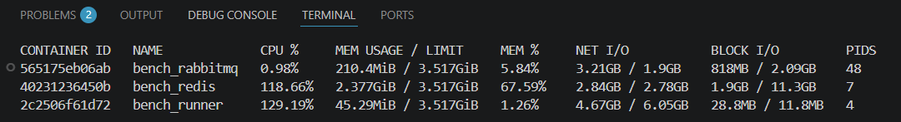

# Отчёт: Сравнение RabbitMQ и Redis как брокеров сообщений

## Стенд и методология

**Инструмент:** собственный producer на Python (`benchmark.py`)  
**Брокеры:** RabbitMQ 3.13-management-alpine, Redis 7-alpine  
**Среда:** Docker Compose, все три контейнера на одной машине  
**Длительность каждого прогона:** 30 секунд (первые 2 с исключены из статистики latency как прогрев)

Условия одинаковые для обоих брокеров:
- один producer-тред и один consumer-тред
- одинаковый формат сообщений: `{"ts": <unix_timestamp>, "data": "<payload>"}`
- одинаковые размеры payload и целевые скорости
- без персистентности (transient queues / Redis Streams без AOF)

Метрики собирались параллельно в отдельном тред-мониторе (раз в секунду):
- **backlog** — глубина очереди: Management API для RabbitMQ, `XLEN` для Redis
- **память брокера** — `/api/nodes` для RabbitMQ, `INFO memory` для Redis

---

## Результаты

### Итоговая таблица

| Broker   | Size  | Target/s | Sent   | Recv   | Lost   | Tput/s | Avg ms  | P95 ms  | BacklogPk | MemPk MB |
|----------|-------|----------|--------|--------|--------|--------|---------|---------|-----------|----------|
| rabbitmq | 128B  | 1,000    | 29,983 | 29,983 | 0      | 999    | 2.6     | 6.5     | 3         | 171      |
| redis    | 128B  | 1,000    | 30,003 | 30,002 | 1      | 1000   | 2.4     | 8.7     | 5,024     | 1,840    |
| rabbitmq | 128B  | 5,000    | 32,331 | 32,331 | 0      | 1,078  | 2.6     | 5.8     | 11        | 160      |
| redis    | 128B  | 5,000    | 48,869 | 48,867 | 2      | 1,629  | 20.4    | 32.2    | 5,023     | 1,840    |
| rabbitmq | 128B  | 10,000   | 31,986 | 31,986 | 0      | 1,066  | 2.5     | 5.6     | 2         | 161      |
| redis    | 128B  | 10,000   | 50,298 | 50,291 | 7      | 1,676  | 17.8    | 26.2    | 5,024     | 1,841    |
| rabbitmq | 1KB   | 1,000    | 29,984 | 29,984 | 0      | 999    | 2.3     | 3.8     | 2         | 161      |
| redis    | 1KB   | 1,000    | 30,001 | 30,001 | 0      | 1,000  | 1.8     | 3.0     | 5,002     | 1,847    |
| rabbitmq | 1KB   | 5,000    | 31,117 | 31,117 | 0      | 1,037  | 2.5     | 5.2     | 3         | 162      |
| redis    | 1KB   | 5,000    | 40,689 | 40,688 | 1      | 1,356  | 326.1   | 109.8   | 5,002     | 1,853    |
| rabbitmq | 1KB   | 10,000   | 30,425 | 30,424 | 1      | 1,014  | 2.7     | 6.0     | 20        | 162      |
| redis    | 1KB   | 10,000   | 47,464 | 47,456 | 8      | 1,582  | 18.1    | 29.4    | 5,002     | 1,858    |
| rabbitmq | 10KB  | 1,000    | 27,191 | 27,191 | 0      | 906    | 3.1     | 7.5     | 9         | 166      |
| redis    | 10KB  | 1,000    | 30,003 | 30,002 | 1      | 1,000  | 2.7     | 4.2     | 5,000     | 1,917    |
| rabbitmq | 10KB  | 5,000    | 27,265 | 27,265 | 0      | 909    | 3.3     | 8.0     | 7         | 166      |
| redis    | 10KB  | 5,000    | 29,503 | 29,500 | 3      | 983    | 3.2     | 4.7     | 5,000     | 1,976    |
| rabbitmq | 10KB  | 10,000   | 26,799 | 26,799 | 0      | 893    | 3.1     | 7.2     | 2         | 168      |
| redis    | 10KB  | 10,000   | 30,207 | 30,206 | 1      | 1,007  | 3.1     | 4.5     | 5,000     | 2,035    |
| rabbitmq | 100KB | 1,000    | 20,905 | 7,966  | 12,939 | 266    | 10,526  | 18,102  | 11,153    | 453      |
| redis    | 100KB | 1,000    | 18,943 | 18,942 | 1      | 631    | 6.4     | 10.1    | 5,000     | 2,582    |
| rabbitmq | 100KB | 5,000    | 8,494  | 4,278  | 4,216  | 143    | 11,661  | 23,486  | 3,489     | 259      |
| **redis**    | **100KB** | **5,000**    | **0**      | **0**      | **0**      | **0**      | **—**       | **—**       | **0**         | **0 ⚠️ OOM**  |
| rabbitmq | 100KB | 10,000   | 18,780 | 10,928 | 7,852  | 364    | 7,075   | 12,599  | 6,743     | 521      |
| **redis**    | **100KB** | **10,000**   | **0**      | **0**      | **0**      | **0**      | **—**       | **—**       | **0**         | **0 ⚠️ OOM**  |

---

## Скриншоты

### 1. Итоговая таблица результатов (терминал)



Финальная таблица со всеми 24 прогонами. Видно деградацию RabbitMQ на 100KB и полный отказ Redis на 100KB при 5000/s и 10000/s.

---

### 2. RabbitMQ Management UI — очереди после теста



Видно что у трёх очередей 100KB после завершения тестов остался backlog: 12,939 / 4,216 / 7,852 сообщений. Это те самые потерянные сообщения — consumer не успел их обработать за время теста, и они зависли в очереди. Остальные очереди (128B, 1KB, 10KB) — пустые, consumer успевал.

---

### 3. RabbitMQ Overview — деградация на 100KB в реальном времени



Скрин сделан во время прогона `rabbitmq 100KB 1000/s`. Два графика наглядно показывают момент деградации single instance:

- **Queued messages** (верхний график) — очередь непрерывно растёт до 9,785 сообщений за ~50 секунд. Consumer не успевает разгребать быстрее чем producer добавляет.
- **Message rates** (нижний график) — publish rate (жёлтый) резко падает с ~750/s до нуля, deliver rate (зелёный) следует за ним. Это момент когда RabbitMQ начал применять backpressure и блокировать publisher из-за переполнения памяти.

Именно этот backlog в 9,785–11,153 сообщений и объясняет avg latency = 10,526 ms и p95 = 18,102 ms из таблицы результатов.

---

### 4. docker stats во время прогона



| Контейнер      | CPU%   | RAM используется |
|----------------|--------|-----------------|
| bench_rabbitmq | ~1%    | 210 MB          |
| bench_redis    | ~119%  | 2.38 GB         |
| bench_runner   | ~129%  | 45 MB           |

Ключевое наблюдение: Redis использует **2.38 GB RAM** против **210 MB у RabbitMQ**. Redis держит все данные стримов в памяти — при накоплении потоков с большими payload это и привело к OOM на последних тестах с 100KB.

---

## Анализ по экспериментам

### 1. Базовое сравнение (128B, 1 000 msg/s)

Оба брокера справились без потерь. RabbitMQ: 999/s, Redis: 1000/s. Практически идентично на низкой нагрузке. Разница проявилась в потреблении памяти: RabbitMQ — 171 MB, Redis — 1840 MB (хранит весь стрим in-memory).

### 2. Влияние размера сообщения

RabbitMQ деградирует линейно с ростом payload:

| Size  | RabbitMQ tput/s |
|-------|-----------------|
| 128B  | 1,066           |
| 1KB   | 1,014           |
| 10KB  | 893             |
| 100KB | 143–364         |

Redis держится стабильнее до 10KB (~1000/s), но при 100KB упирается в RAM и в двух из трёх прогонов полностью отказал (sent=0).

**Вывод:** Redis лучше переносит рост размера сообщения в диапазоне до 10KB, но при больших payload ограничен объёмом RAM. RabbitMQ деградирует по throughput, но хотя бы частично продолжает работать.

### 3. Влияние интенсивности потока

Ни один брокер не достиг целевых 5 000 и 10 000 msg/s. Фактический потолок:
- **RabbitMQ** — ~1 000–1 078 msg/s независимо от target
- **Redis** — ~1 356–1 676 msg/s на малых сообщениях

Причина — синхронный Python-клиент: `pika` делает один `basic_publish` за раз с ожиданием ответа, `redis-py` аналогично. Это не ограничение брокеров, а ограничение клиентского кода. Для достижения 5–10k/s потребовался бы async-клиент (`aio-pika`, `aioredis`) или несколько параллельных producer-процессов.

**Точка деградации RabbitMQ:** на 10KB throughput уже ниже 1000/s (893/s), на 100KB — полный коллапс (143–364/s, avg latency 7–11 секунд, p95 до 23 секунд, потери 42–62%).

**Точка деградации Redis:** 100KB при наличии накопленных предыдущих стримов в памяти → OOM → контейнер упал. Это подтверждается ошибкой в логах:
```
socket.gaierror: [Errno -5] No address associated with hostname
redis.exceptions.ConnectionError: Error -5 connecting to redis:6379
```
DNS перестал резолвить имя `redis` — контейнер упал физически. После теста 100KB 1000/s (peak mem = 2,582 MB) Redis не смог пережить следующие два прогона. Результат `sent=0, recv=0` — это не "ничего не отправил", это **крэш процесса**.

---

## Выводы

### Какой брокер показал бо́льшую пропускную способность?

**Redis** — на малых сообщениях (128B–1KB) Redis выдаёт 1 356–1 676 msg/s против 999–1 078 msg/s у RabbitMQ. Это объясняется тем, что RESP-протокол Redis проще AMQP: меньше handshake, нет framing overhead.

### Какой брокер лучше переносит рост размера сообщения?

**Redis** лучше справляется в диапазоне 128B–10KB — throughput и latency почти не меняются. RabbitMQ начинает деградировать уже на 10KB (893/s вместо 999/s), а на 100KB переходит в критическое состояние (avg latency >10 секунд). Однако при 100KB Redis в итоге упирается в RAM и отказывает полностью — это принципиальное ограничение in-memory архитектуры.

### При какой нагрузке начинают деградировать single instance?

| Брокер   | Первые симптомы          | Полный коллапс                                |
|----------|--------------------------|-----------------------------------------------|
| RabbitMQ | 10KB (tput -10%)         | 100KB: avg=10–11с, p95=18–23с, потери до 62%  |
| Redis    | 100KB 1000/s (tput -37%) | 100KB 5000+/s: OOM, sent=0, полный отказ      |

### Какой инструмент лучше подходит для такого сценария?

Собственный producer — единственный адекватный выбор для сравнения разнопротокольных брокеров. `k6` и `Locust` заточены под HTTP и не имеют нативных AMQP/Redis-Stream коннекторов. Собственный producer даёт полный контроль над форматом сообщений, rate limiting, измерением end-to-end latency через embedded timestamp и одинаковыми условиями для обоих брокеров.

Для достижения реальных 5 000–10 000 msg/s следующий шаг — перейти на async-клиенты (`aio-pika` для RabbitMQ, `redis.asyncio` для Redis) и запустить несколько параллельных producer-процессов.

---

### Итоговая рекомендация

| Сценарий | Рекомендация |
|---|---|
| Маленькие сообщения (<10KB), высокий throughput | Redis — быстрее, проще протокол |
| Большие сообщения (>10KB), надёжность важнее | RabbitMQ — деградирует плавно, не падает в OOM |
| Нужен гарантированный порядок и ack | RabbitMQ — AMQP обеспечивает это из коробки |
| Ограниченная RAM на сервере | RabbitMQ — потребляет в 10+ раз меньше памяти |
